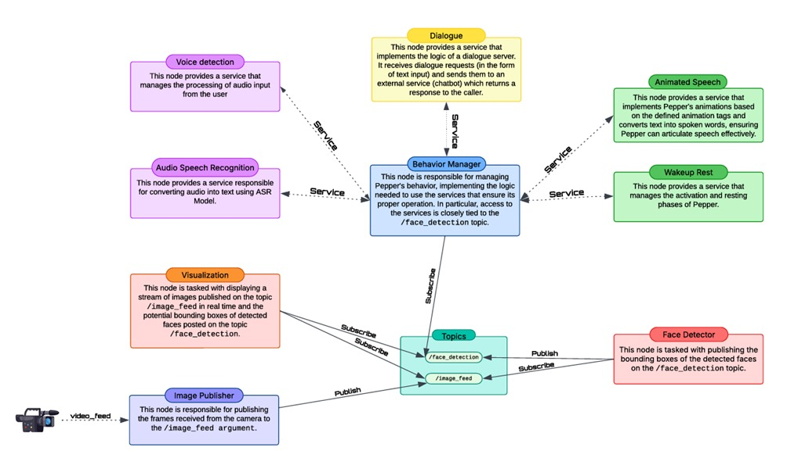

# 🤖 Guardian of the Aisles: Enhancing Customer Experience in Shopping Malls with Pepper

## 🏬 Project Overview
This project introduces an AI-powered robotic assistant designed for shopping malls, featuring **Pepper** as an interactive guide and security assistant. Utilizing **video analytics, speech recognition, and ROS-based architecture**, Pepper enhances the customer experience by engaging in meaningful conversations and providing real-time information.

---

## 📌 Features
- ✅ **Speech-to-Text (S2T) and Text-to-Speech (TTS)**: Enables natural human-robot interaction
- ✅ **Chatbot Integration**: Answers questions about the mall and the **Artificial Vision Contest 2025**
- ✅ **ROS-Based Modular Architecture**: Ensures flexibility, efficiency, and scalability
- ✅ **Multiple Hardware Configurations**: Works with **Pepper's camera** and **external cameras**
- ✅ **Interactive Animations**: Synchronizes speech with gestures for more natural interactions

---

## 📁 Project Structure
```
├── 📁 src/
│   ├── 📁 shopping_mall_assistant/
│   │   ├── 📁 launch/
│   │   │   ├── animated_speech.xml
│   │   │   ├── dialogue.xml
│   │   │   ├── face_detector_nopepper.xml
│   │   │   ├── face_detector.xml
│   │   │   ├── s2t_nopepper.xml
│   │   │   ├── s2t.xml
│   │   │   ├── start.xml
│   │   ├── 📁 scripts/
│   │   │   ├── 📁 chatbot/
│   │   │   │   ├── dialogue_server.py
│   │   │   ├── 📁 Detector/
│   │   │   │   ├── FaceDetectorModels/
│   │   │   │   ├── face_detector_node.py
│   │   │   │   ├── visualization_node.py
│   │   │   ├── 📁 PepperNodes/
│   │   │   │   ├── animated_speech_node.py
│   │   │   │   ├── image_publisher_node.py
│   │   │   │   ├── session.py
│   │   │   │   ├── wakeup_rest_node.py
│   │   │   ├── 📁 S2T/
│   │   │   │   ├── asr_node.py
│   │   │   │   ├── voice_detection_node.py
│   │   │   ├── behavior_manager_node.py
│   │   │   ├── service_handler.py
│   │   ├── 📁 srv/
│   │   ├── 📁 test/
│   │   │   ├── 📁 TestSet/
│   │   │   │   ├── FDDB_Kaggle/
│   │   │   │   ├── test_cases.json
│   │   │   ├── animated_speech_test.py
│   │   │   ├── audio_test.py
│   │   │   ├── chatbot_test.py
│   │   │   ├── face_detector_test.py
├── 📁 report/
│   ├── ROSArchitecture.jpeg
│   └── ReportGroup4.pdf
├── requirements.txt
└── README.md
```
---
## 🏛️ ROS-Based Architecture

The system is built on a modular architecture using the Robot Operating System (ROS). The nodes communicate primarily through ROS topics for continuous data streams (like video frames and detection results), and ROS services for request-response operations (like speech recognition or animated speech). 



Below is a brief overview of the main nodes and how they interact:

- The **Image Publisher Node** captures frames from either Pepper's onboard camera or an external USB camera and publishes them on the `/image_feed` topic.

- The **Face Detector Node** subscribes to `/image_feed` and applies an OpenCV DNN model to detect and track faces. The detection results (bounding boxes, confidence scores, and IDs) are then published to the `/face_detection` topic.

- The **Visualization Node** subscribes to both `/image_feed` and `/face_detection`, overlaying the detection results onto the video stream for real-time feedback.

- The **Voice Detection Node** exposes a service that activates the microphone and records audio only when explicitly requested—typically when a user is detected nearby.

- The recorded audio is passed to the **Audio Speech Recognition (ASR) Node**, which uses OpenAI’s Whisper model (via Azure API) to transcribe the speech into text. This is handled via a dedicated ROS service.

- The transcribed text is sent to the **Dialogue Node**, which acts as an interface with a GPT-4o chatbot. It generates a natural language response and returns it to the system.

- The **Animated Speech Node** receives the chatbot's response and uses Pepper’s NAOqi Animated Speech API to deliver the message vocally, synchronized with gestures.

- The **Wakeup/Rest Node** manages Pepper’s physical state transitions, allowing it to wake up, become aware of its surroundings, or rest to save energy.

- At the center of the system is the **Behavior Manager Node**, which orchestrates the full interaction cycle. It listens for face detections, triggers voice capture, initiates speech recognition and dialogue, and finally coordinates Pepper’s spoken response. It ensures the system responds appropriately based on context and user presence.

This node-based architecture ensures that each component is independently testable, replaceable, and extensible, making it suitable for real-world deployment in dynamic environments like shopping malls.

---

## 🔧 Installation & Setup
### Prerequisites
- **ROS Noetic** (Recommended)
- **Python 3.8+**
- **OpenCV** (for face detection)
- **Azure OpenAI API Key** (for chatbot & speech recognition)
- **Pepper SDK (NAOqi)**

### Installation Steps
```bash
# Clone the repository
git clone https://github.com/Crostino14/Cognitive-Robotics-Group-4.git
cd ./src/shopping_mall_assistant

# Install dependencies
pip install -r requirements.txt

# Set up ROS workspace
chmod u+x src/shopping_mall_assistant/*
chmod u+x src/shopping_mall_assistant/scripts/*
chmod u+x src/shopping_mall_assistant/scripts/Detector/*
chmod u+x src/shopping_mall_assistant/scripts/PepperNodes/*
chmod u+x src/shopping_mall_assistant/scripts/S2T/*
chmod u+x src/shopping_mall_assistant/scripts/chatbot/*
chmod u+x src/shopping_mall_assistant/test/*

source /opt/ros/noetic/setup.bash
catkin_make
source devel/setup.bash
```

### Running the System
```bash
# Start the entire system
roslaunch shopping_mall_assistant start.xml

# Run individual modules
roslaunch shopping_mall_assistant face_detector.xml
roslaunch shopping_mall_assistant dialogue.xml
roslaunch shopping_mall_assistant s2t.xml
roslaunch shopping_mall_assistant animated_speech.xml
```

---

## 🎥 Demo Video
[📥 Watch the demo on Google Drive](https://drive.google.com/file/d/1LS7Xfg6_a6G1aKRtQw2oVOriNsTCAWYh/view?usp=sharing)

---

## 📄 Project Report
[📑 View the full project report (PDF)](report/ReportGroup4.pdf)

---

## 📜 Technical Details
The system is built on **ROS (Robot Operating System)**, leveraging **OpenCV** for computer vision and **OpenAI’s Whisper** for speech recognition. It consists of several key modules:

### 🟢 **Face Detection Module**
- Uses **OpenCV DNN** to detect and track faces in real-time
- Operates on **Pepper's onboard camera** or an **external camera**

### 🟢 **Speech-to-Text & Chatbot Module**
- Utilizes **OpenAI’s Whisper** for accurate speech transcription
- Implements an **AI chatbot (GPT-4o)** for interactive conversations

### 🟢 **Animated Speech & Behavior Management**
- Synchronizes speech with gestures using **NAOqi API**
- Dynamically adapts Pepper’s responses based on detected individuals

---

## 📩 Authors
**Project Team**: 
- **Agostino Cardamone** - [a.cardamone7@studenti.unisa.it](mailto:a.cardamone7@studenti.unisa.it)
- **Chiara Ferraioli** - [c.ferraioli30@studenti.unisa.it](mailto:c.ferraioli30@studenti.unisa.it)
- **Asja Antonucci** - [a.antonucci5@studenti.unisa.it](mailto:a.antonucci5@studenti.unisa.it)
- **Viktor Dobrev** - [v.dobrev@studenti.unisa.it](mailto:v.dobrev@studenti.unisa.it)
